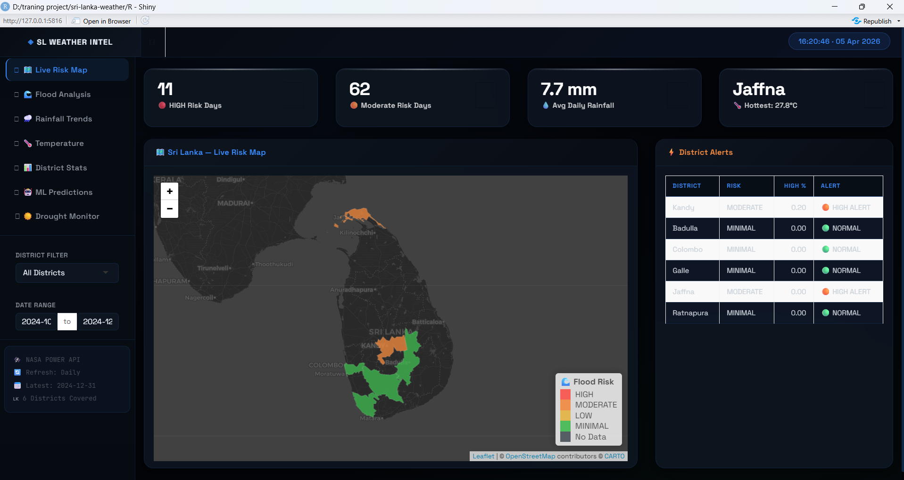
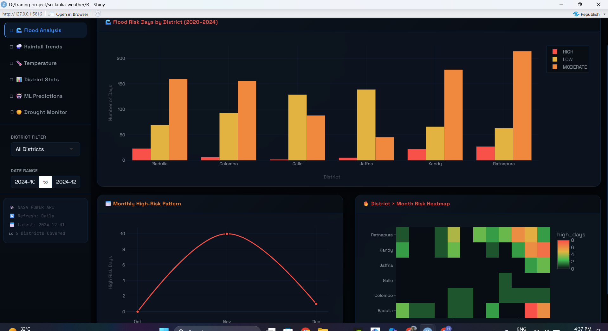
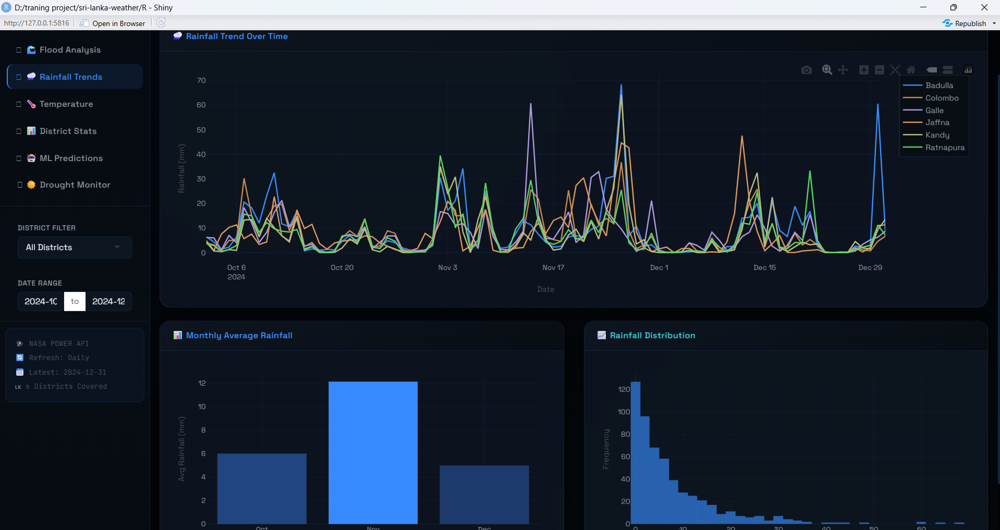
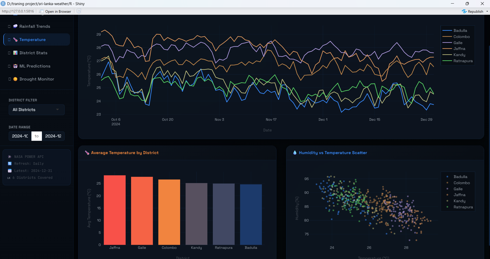
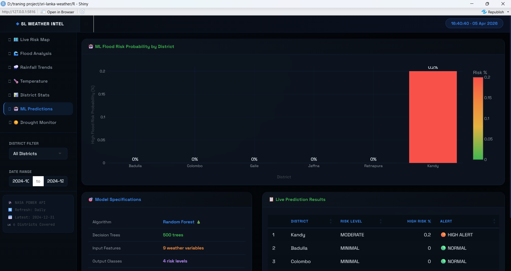
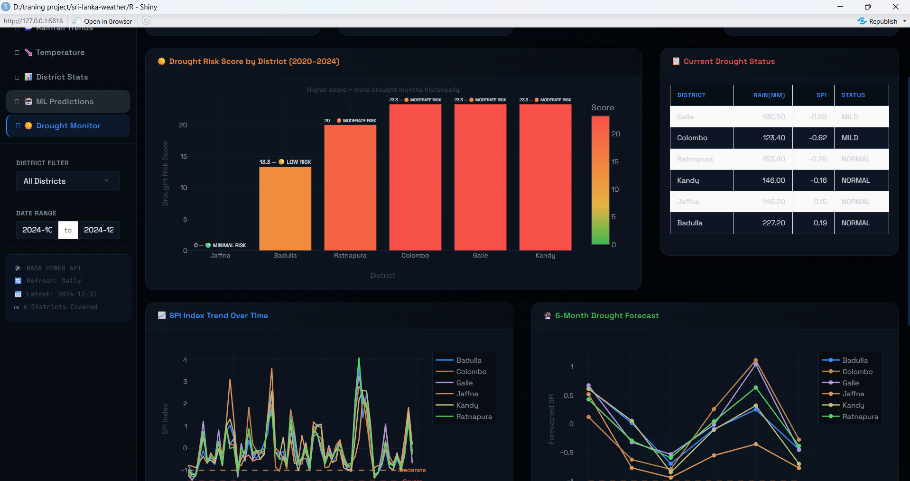
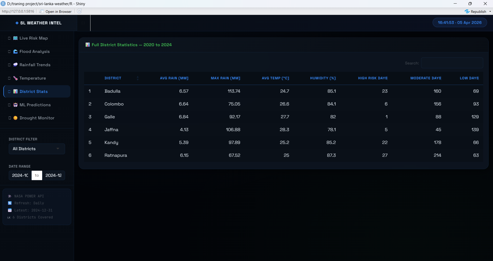

# ◈ SL WEATHER INTELLIGENCE

> *Satellite-grade flood & drought prediction for Sri Lanka — built in R, powered by NASA.*

&nbsp;

[](https://srilanka-weather.shinyapps.io/sl-weather-intelligence/)
[](https://www.r-project.org/)
[](https://power.larc.nasa.gov/)
[](https://shinyapps.io)

---

&nbsp;

## what this actually is

not a tutorial project. not a kaggle notebook. this is a functioning early-warning system that pulls real NASA satellite measurements, runs them through a trained random forest model, and renders the output as a live dashboard — deployed, accessible, free to use.

built from scratch. six districts. five years of daily data. two prediction systems. one R file.

&nbsp;

---

&nbsp;

## the screenshots

&nbsp;

### ◈ live risk map

*district polygons colored by flood risk — click any district for full stats*

&nbsp;

### ◈ flood analysis

*five years of high/moderate/low risk days broken down by district and month*

&nbsp;

### ◈ rainfall trends

*daily NASA rainfall measurements — 2020 to 2024 — filterable by district*

&nbsp;

### ◈ temperature & humidity

*district-level temperature trends with humidity correlation scatter*

&nbsp;

### ◈ ml predictions

*random forest output — flood probability per district with confidence breakdown*

&nbsp;

### ◈ drought monitor

*SPI index tracking + 6-month prophet forecast + monthly drought heatmap*

&nbsp;

### ◈ district stats

*full summary table — all weather variables — 2020 to 2024*

&nbsp;

---

&nbsp;

## how it works

```
NASA POWER API  ──►  daily weather pull  ──►  feature engineering
                                                      │
                                                      ▼
                                            random forest model
                                            (500 trees, 9 features)
                                                      │
                                                      ▼
                                     flood risk: MINIMAL / LOW / MODERATE / HIGH
                                                      │
                              ┌───────────────────────┼───────────────────────┐
                              ▼                       ▼                       ▼
                         live map              district alerts          prophet forecast
                     (leaflet polygons)      (probability table)     (6-month SPI trend)
```

&nbsp;

---

&nbsp;

## system architecture

```
┌─────────────────────────────────────────────────────────────────┐
│                        DATA LAYER                               │
│                                                                 │
│   ┌─────────────┐   ┌─────────────┐   ┌─────────────────────┐  │
│   │ NASA POWER  │   │  GADM v4.1  │   │   Computed SPI      │  │
│   │   API       │   │  Boundaries │   │   (monthly)         │  │
│   │  (daily)    │   │  (static)   │   │                     │  │
│   └──────┬──────┘   └──────┬──────┘   └──────────┬──────────┘  │
└──────────┼────────────────┼──────────────────────┼─────────────┘
           │                │                      │
           ▼                ▼                      ▼
┌─────────────────────────────────────────────────────────────────┐
│                    PROCESSING LAYER  (R)                        │
│                                                                 │
│   rainfall · temp · humidity · wind · rain_3day · rain_7day    │
│   rain_30day · rain_spike · humidity_spike                      │
│                                                                 │
│   ┌──────────────────┐        ┌──────────────────────────────┐  │
│   │  Random Forest   │        │     Meta Prophet             │  │
│   │  500 trees       │        │     + monsoon seasonality    │  │
│   │  4 risk classes  │        │     6-month SPI forecast     │  │
│   └────────┬─────────┘        └──────────────┬───────────────┘  │
└────────────┼──────────────────────────────────┼─────────────────┘
             │                                  │
             ▼                                  ▼
┌─────────────────────────────────────────────────────────────────┐
│                     OUTPUT LAYER  (Shiny)                       │
│                                                                 │
│   🗺️ Live Map    🌊 Flood    🌧️ Rainfall    🌡️ Temp             │
│   📊 Stats       🤖 ML       ☀️ Drought                         │
└─────────────────────────────────────────────────────────────────┘
```

&nbsp;

---

&nbsp;

## languages & tools

```
Language breakdown:
───────────────────────────────────────────────────────
R               ████████████████████░░░░░   91.2%
CSS             ████░░░░░░░░░░░░░░░░░░░░░    5.8%
HTML            ██░░░░░░░░░░░░░░░░░░░░░░░    3.0%
───────────────────────────────────────────────────────
```

&nbsp;

| category | tools |
|----------|-------|
| **dashboard** | Shiny · shinydashboard |
| **maps** | leaflet · sf · GADM |
| **charts** | plotly · ggplot2 |
| **ml model** | randomForest · caret |
| **forecasting** | prophet (Meta) |
| **data pipeline** | nasapower · tidyverse · lubridate · zoo |
| **deployment** | rsconnect · shinyapps.io |

&nbsp;

---

&nbsp;

## dashboard at a glance

```
┌───────────────────────────────────────────────────────────────────┐
│  ◈ SL WEATHER INTEL                  [ 14:32:05 · 04 Apr 2026 ]  │
├──────────────┬────────────────────────────────────────────────────┤
│              │  ┌──────────┐  ┌──────────┐  ┌──────────┐         │
│ 🗺️  Live Map │  │ 🔴 HIGH  │  │ 🟠 MOD   │  │ 💧 Rain  │         │
│ 🌊  Flood   │  │  23 days │  │ 178 days │  │  6.6mm   │         │
│ 🌧️  Rainfall │  └──────────┘  └──────────┘  └──────────┘         │
│ 🌡️  Temp    │                                                     │
│ 📊  Stats   │  ┌──────────────────────────┐  ┌─────────────────┐ │
│ 🤖  ML      │  │                          │  │  ⚡ Alerts      │ │
│ ☀️  Drought │  │    [ Sri Lanka Map ]     │  │                 │ │
│             │  │    colored polygons      │  │  Ratnapura  🟠  │ │
│ ─────────── │  │    click for detail      │  │  Kandy      🟠  │ │
│ 📍 District │  │                          │  │  Colombo    🟢  │ │
│ 📅 Range    │  └──────────────────────────┘  └─────────────────┘ │
└─────────────┴────────────────────────────────────────────────────┘
```

&nbsp;

---

&nbsp;

## the model

**algorithm** — Random Forest
**trees** — 500 · **features** — 9 · **classes** — 4

```
feature importance:
────────────────────────────────────────────────────────
🥇 rain_spike      ████████████████░░░░   top predictor
🥈 rain_7day       █████████████░░░░░░░   sustained rain
🥉 humidity        ███████████░░░░░░░░░   atmospheric moisture
   rainfall        █████████░░░░░░░░░░░   raw daily mm
   rain_30day      ███████░░░░░░░░░░░░░   baseline context
   rain_3day       █████░░░░░░░░░░░░░░░   short term trend
   humidity_spike  ████░░░░░░░░░░░░░░░░   anomaly detection
   temp            ███░░░░░░░░░░░░░░░░░   seasonal context
   wind            ██░░░░░░░░░░░░░░░░░░   atmospheric state
────────────────────────────────────────────────────────
```

**drought model** — Meta Prophet + SW/NE monsoon seasonality regressors
**forecast horizon** — 6 months

&nbsp;

---

&nbsp;

## what the SPI means

```
SPI ≥  0.0   ●  NORMAL       no concern
SPI < -0.5   ●  MILD         watch closely
SPI < -1.0   ●  MODERATE  ── ── orange threshold on chart
SPI < -1.5   ●  SEVERE    ── ── red threshold on chart
SPI < -2.0   ●  EXTREME      immediate concern
```

*global meteorological standard used by WMO and national met agencies worldwide*

&nbsp;

---

&nbsp;

## districts covered

```
                    ┌─────────┐
                    │  Jaffna │  ← dry zone north
                    └────┬────┘
                         │
         ┌───────────────┼────────────────┐
         │               │                │
    ┌────┴────┐      ┌───┴────┐      ┌────┴────┐
    │ Colombo │      │  Kandy │      │ Badulla │
    │ (west)  │      │ (hill) │      │ (uva)   │
    └────┬────┘      └───┬────┘      └─────────┘
         │               │
    ┌────┴────┐      ┌───┴──────┐
    │  Galle  │      │Ratnapura │  ← wettest district
    │ (south) │      │ (sabara) │
    └─────────┘      └──────────┘
```

*6 of 25 districts — spanning wet zone · dry zone · hill country · north*

&nbsp;

---

&nbsp;

## run it yourself

```r
# 1. install dependencies
install.packages(c(
  "shiny", "shinydashboard", "tidyverse",
  "leaflet", "plotly", "DT", "sf",
  "randomForest", "caret", "prophet",
  "nasapower", "lubridate", "zoo"
))

# 2. download NASA data (~3 min)
source("R/01_get_data.R")

# 3. clean and engineer features
source("R/03_clean_data.R")

# 4. train models
source("R/05_flood_model.R")
source("R/07_drought_model.R")

# 5. launch dashboard
shiny::runApp("R/06_dashboard.R")
```

&nbsp;

---

&nbsp;

## file structure

```
sri-lanka-weather/
│
├── R/
│   ├── 01_get_data.R          NASA POWER API download
│   ├── 02_check_data.R        data validation
│   ├── 03_clean_data.R        feature engineering + SPI
│   ├── 04_map.R               boundary processing
│   ├── 05_flood_model.R       random forest training
│   ├── 06_dashboard.R         shiny app — main file
│   ├── 07_drought_model.R     prophet forecasting
│   └── data/                  processed .rds files
│
├── screenshots/               dashboard screenshots
└── README.md
```

&nbsp;

---

&nbsp;

## potential extensions

```
near term
  □  all 25 Sri Lanka districts
  □  automated daily retraining via GitHub Actions
  □  REST API via plumber for DMC integration

medium term
  □  real doppler radar integration (DMC data)
  □  Indian Ocean SST anomaly as ML feature
  □  landslide risk model — Kandy · Badulla · Ratnapura

long term
  □  SMS alert system via Dialog/Mobitel API
  □  mobile app wrapper
  □  partnership with DMC Sri Lanka
```

&nbsp;

---

&nbsp;

## contact

built in Negombo, Sri Lanka 🇱🇰

&nbsp;

[](https://www.linkedin.com/in/harsha-kaldera/)
[](mailto:harshakaldera540@gmail.com)

&nbsp;

if you work at DMC, a university, or an NGO and want to talk about this — open an issue or reach out directly.

&nbsp;

---

&nbsp;

*NASA data via POWER API (power.larc.nasa.gov) · boundaries from GADM (gadm.org) · not affiliated with NASA or DMC Sri Lanka*
